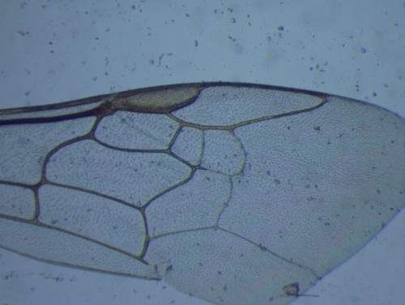
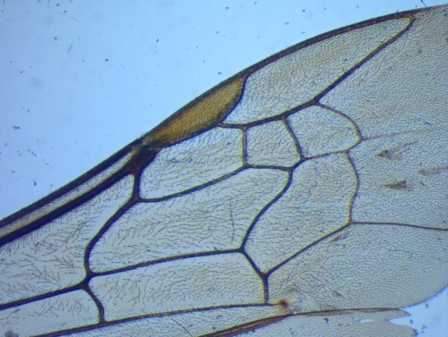
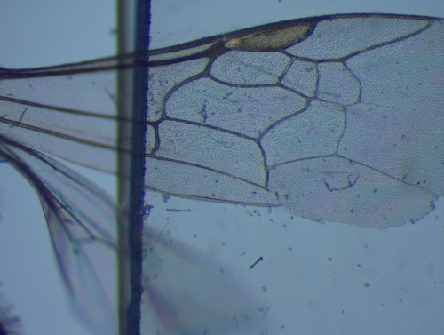
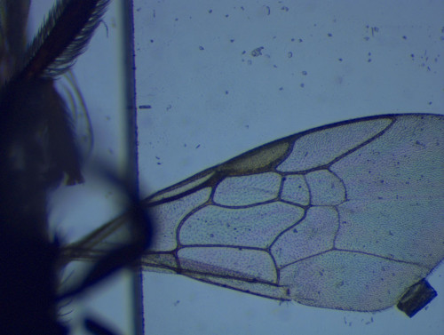
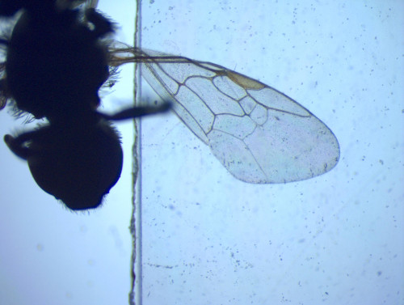

# Deepwings 

This project follows the beewing project : https://github.com/machine-shop/beewing, which is itself inspired by the idBee project from the University of Wisconsin-Madison : http://idbee.ece.wisc.edu/

## Description

This project enables to classify bee species from pictures of their wings.

Supported species (21):
- Agapostemon sericeus
- Agapostemon texanus
- Agapostemon virescens
- Bombus bimaculata
- Bombus griseocolis
- Bombus impatiens
- Ceratina calcarata
- Lasioglossum acuminatum
- Lasioglossum coriaceum
- Lasioglossum leucozonium
- Lasioglossum mawispb
- Lasioglossum nymphaerum
- Lasioglossum pilosum
- Lasioglossum rohweri
- Lasioglossum zephyrum
- Lasioglossum zonulum
- Osmia coloradensis
- Osmia lignaria
- Osmia pusilla
- Osmia ribifloris
- Osmia texana

## Project motivation

As stated in the idBee project :

"About 35% of the world's crops and 80% of the world’s flowers are pollinated by bees! Most bees that are farmed for pollination are European Honeybees, whose physique and behavior makes them very efficient. But native bees can share in the pollination effort, and some may be more efficient.

Recently, honeybees have been dying off at an extraordinarily high rate, and no one is quite sure why. Researchers call it Colony Collapse Disorder, and the problem is serious because of our dependence on honeybees to pollinate food crops. While many are researching the cause of Colony Collapse Disorder, research into native bees may uncover more productive alternatives to the European honeybee. Finding the cause and potential native alternatives involve tracking wild bee populations and habits.

There are many species of bees, more than 500 in Wisconsin alone, but it's not easy to tell which species an individual belongs to.

While bee species identification is essential to research, identifying the species of a bee can be expensive and time-consuming. Since there are few experts who can reliably distinguish many different species, bees must be captured and sent to an expert, which may take several months. Bee research can be excruciatingly slow.

Rather than capturing, killing, and sending the bees off to be catalogued, imagine an iPhone app that lets graduate students and researchers identify bees in the field. One could simply take a photo of a bee and instantly record its species and location. Research could be conducted much faster, and identified bees could be released back to nature."


## Improvements

This time, we propose two methods : 
* A Convolutional Neural Network approach using DenseNet121
* A classical pipeline with features extraction followed by an artificial Artificial Neural Network classifier

## Getting Started
These instructions will get you a copy of the project up and running on your local machine for development and testing purposes. 
### Dependencies
* Keras
* TensorFlow <= 1.10.0
* Numpy
* Pandas
* Python 3.5
* Scikit-image
* Scikit-learn
* Scipy

### Installing

To download the project :
```
$ git clone https://github.com/machine-shop/deepwings
$ cd deepwings
$ pip install -r requirements.txt
```

## Usage
### Images specifications
The typical size of our images is 2039x1536 pixels. The images should feature only the wing of the bee (body on the left side of the image) as follows :




On the other side, those types of images should be avoided :






## Download the models

Download the models using [this link](https://www.dropbox.com/sh/b0g2fa2l2yno9w8/AAAmehs4TMMfMqQDibqhlzNpa?dl=0).
They should be placed in deepwings/training/models/.


### Predicting
This project comes with pretrained models for both the CNN and ANN methods.
Move the pictures you want to predict to *prediction/raw_images/*. Then run:

#### CNN
This method is preferred as it is faster and slightly more accurate. To predict species of your images, run :
```
$ python pipeline.py -pred cnn 
```
#### Feature extraction + random_forest/ann
First you need to extract the features from your pictures, then run the ANN classifier :
```
$ python pipeline.py -e pred
$ python pipeline.py -pred random_forest
```
or :
``` 
$ python pipeline.py -e pred -pred random_forest
```
Optional arguments :
```
$ python pipeline.py -e pred -pred random_forest --plot --category genus
```
* *--plot, -p* : if specified, explanatory figures will be plotted in *prediction/valid_images/* and *prediction/invalid_images/*
* *--category, -c* : 'genus' or 'species'(default). Specifies if the model must be a genus or species classifier.

The prediction results should appear in a csv file in *prediction/prediction_ann.csv*.

You can also use a pretrained ANN model :
``` 
$ python pipeline.py -e pred -pred ann 
```


### Training

Move all your raw images to *training/raw_images/*. Then run:
The dataset used in this project is available [here](https://www.dropbox.com/s/5pu4934n72vycir/bee_wings_data.zip?dl=0)

#### 1. Filename convention
The name of each image is composed of an unique identification number (per bee), the genus of the bee, the species of the bee.
In addition, you may add the following information (optional) : the subspecies of the bee, whether the right or left wing was used, the gender of the bee, and finally the magnification of the stereoscope with each value separated by a space.     

Example : *30 Lasioglossum rohweri f left 4x bx.jpg* or *1239 Osmia lignaria propinqua f right 4x.jpg*

#### 2. Building the dataset


``` 
$ python pipeline.py -s 
```
This will sort the images and build the training/test datasets. You can add a few optional arguments:
```
$ python pipeline.py -s --category genus --min_images 5 --test-size 0.25
```
* *--category, -c* : 'genus' or 'species'(default). Specifies if the model must be a genus or species classifier.
* *--min_images, -m* : minimum number of images needed for a category (genus/species) to be taken into account (default 20).
* *--test-size, -ts* : number between 0 and 1, specifying the ratio *#test/#total* (default 0.3)

If you just want to see the output without changing subfolders:
```
$ python pipeline.py -l --category genus --min_images 5
```


#### 3. Train DenseNet121
It's strongly advised to run this with a GPU:

```
$ python pipeline.py --train cnn
```
You can add a few optional arguments:
```
$ python pipeline.py --train cnn --n_epochs 30 
```
* *--n_epochs* : Number of epochs used for training (default 20).
* *--batch_size_train, -bs_train* : Batch size used for CNN training (default 20). 
* *--batch_size_test, -bs_test* : Batch size used for CNN validation (default 20). 
* *--steps_epoch* : Number of steps per epoch (default 100).

This command will train a new model to *training/models/cnn/[model_name]/*. It will also plot the accuracies and losses according to the epoch. 

To use this model :
```
$ python pipeline.py -pred cnn --name_cnn [model_name]
```

#### 4. Features extraction
```
$ python pipeline.py -e train -restart
```
This process can last a few hours depending on the size of your dataset.
This will create several spreadsheets :
* *valid.csv* : Features of valid images 
* *invalid.csv* : List of images whose features could not be properly extracted

If this process gets interrupted at some point, you can pick up extraction where you left off with:
```
$ python pipeline.py -e train
```
Optional arguments :
```
$ python pipeline.py -e train --plot --n_fourier_descriptors 25
```
* *--n_fourier_descriptors, -fd* : number of fourier descriptors extracted for each cell detected (15 by default) 
* *--plot, -p* : if specified, explanatory figures will be plotted in *training/valid_images/* and *training/invalid_images/*

#### 5. Random Forest

Then you can proceed to train the random forest:
```
$ python pipeline.py -t random_forest [-c genus]
```
This will update the models in *training/models/random_forest/[category]/*.

To use this model on prediction/raw_images/:
```
$ python pipeline.py -e pred
$ python pipeline.py -pred random_forest [-c genus]
```

#### 6. Artificial Neural Network
This is a very basic ANN, any other classifier could be used for this task. Once the features are extracted, you can run:

Then you can proceed to train :
```
$ python pipeline.py -t ann [-c genus]
```
This will update the models in *training/models/ann/[category]/*.

To use this model on prediction/raw_images/:
```
$ python pipeline.py -e pred
$ python pipeline.py -pred ann [-c genus]
```
